# Azure Networking Lab 1 — 3-Tier Architecture with Load Balancer

## Overview

This lab demonstrates a practical 3-tier application architecture in Microsoft Azure using Azure networking and security services.

The objective was to build Web, Application, and Database tiers, control communication between the tiers using Network Security Groups (NSGs) and Application Security Groups (ASGs), provide private VM management using Azure Bastion, and expose the Web tier through an Azure Load Balancer.

The lab also included connectivity testing, NSG troubleshooting, and Load Balancer health-probe/failover testing.

## Architecture

The lab implements a 3-tier application architecture in Azure:

- Web Tier — handles HTTP traffic
- Application Tier — handles application-level communication
- Database Tier — provides database connectivity
- Azure Bastion — provides secure management access to private VMs
- Azure Load Balancer — Distributes TCP/HTTP traffic across Web VMs

### Architecture Diagram

```text
                         Internet
                            |
                            v
                  Azure Load Balancer
                       TCP :80
                            |
                   +--------+--------+
                   |                 |
                   v                 v
              Web VM 01          Web VM 02
              ASG-Web             ASG-Web
                   |                 |
                   +--------+--------+
                            |
                         TCP :443
                            |
                   +--------+--------+
                   |                 |
                   v                 v
              App VM 01          App VM 02
              ASG-App             ASG-App
                   |
                TCP :1433
                   |
                   v
                DB VM 01
                ASG-DB
```

### VNet Topology

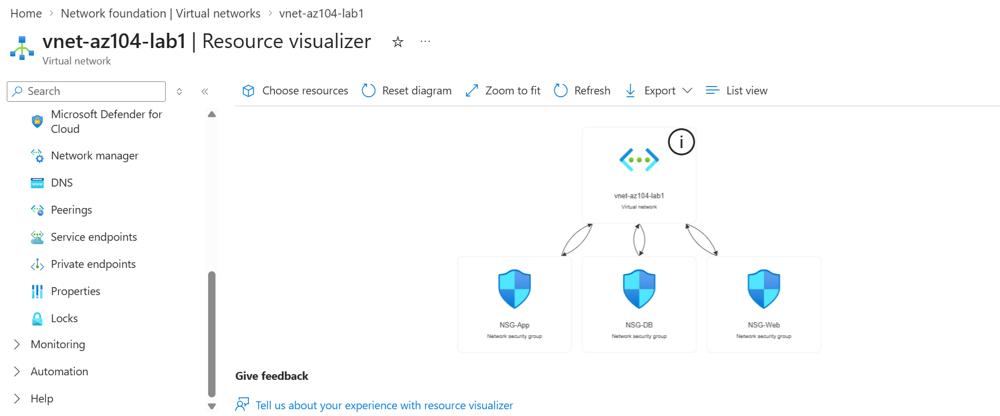

The VNet contains separate subnets for the Web, Application, Database, and Azure Bastion components. This provides logical network segmentation between application tiers.

### VNet and Subnets

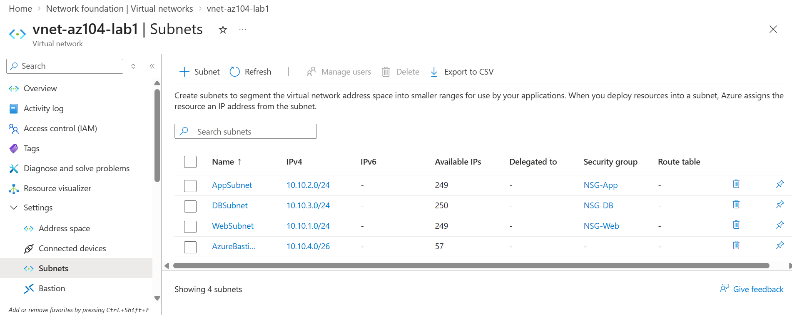

## Azure Resources

The following Azure resources were created as part of this lab:

| Resource | Purpose |
|---|---|
| Virtual Network | Provides the private network environment |
| Web Subnet | Hosts the Web tier VMs |
| App Subnet | Hosts the Application tier VMs |
| DB Subnet | Hosts the Database tier VM |
| AzureBastionSubnet | Provides secure administrative access to private VMs |
| Web VMs | Hosts the Web tier |
| App VMs | Hosts the Application tier |
| DB VM | Hosts the Database tier |
| Network Security Groups | Controls inbound and outbound network traffic |
| Application Security Groups | Groups VMs based on application roles |
| Azure Load Balancer | Distributes traffic across Web VMs |
| Azure Bastion | Provides secure SSH access without exposing VM SSH ports |

## Network Configuration

### Virtual Network

| Configuration | Value |
|---|---|
| VNet Name | `vnet-az104-lab1` |
| Address Space | `10.10.0.0/16` |

### Subnets

| Subnet | Address Range | Purpose |
|---|---|---|
| WebSubnet | `10.10.1.0/24` | Web tier |
| AppSubnet | `10.10.2.0/24` | Application tier |
| DBSubnet | `10.10.3.0/24` | Database tier |
| AzureBastionSubnet | `10.10.4.0/26` | Azure Bastion |

### Virtual Machines

| VM | Tier | Private IP |
|---|---|---|
| web-vm-01 | Web | `10.10.1.4` |
| web-vm-02 | Web | `10.10.1.5` |
| app-vm-01 | Application | `10.10.2.4` |
| app-vm-02 | Application | `10.10.2.5` |
| db-vm-01 | Database | `10.10.3.4` |

### Management Access

Azure Bastion was used to securely connect to the private VMs without exposing SSH ports directly to the Internet.

```text
Administrator
     |
  Internet
     |
 Azure Bastion
     |
 Azure VNet
     |
 Private VMs
```

### Network Segmentation

```text
VNet: 10.10.0.0/16
|
+-- WebSubnet
|   10.10.1.0/24
|   |
|   +-- web-vm-01
|   +-- web-vm-02
|
+-- AppSubnet
|   10.10.2.0/24
|   |
|   +-- app-vm-01
|   +-- app-vm-02
|
+-- DBSubnet
|   10.10.3.0/24
|   |
|   +-- db-vm-01
|
+-- AzureBastionSubnet
    10.10.4.0/26
```

### Traffic Flow

```text
Internet
   |
   | TCP 80
   v
Load Balancer
   |
   v
Web Tier
   |
   | TCP 443
   v
Application Tier
   |
   | TCP 1433
   v
Database Tier
```

### Security Flow

```text
Internet → Web :80       ALLOWED
Web → App :443           ALLOWED
App → DB :1433           ALLOWED
Web → DB :1433           DENIED
```

## Network Security Groups and Application Security Groups

### Application Security Groups

Application Security Groups (ASGs) were used to logically group VMs according to their application role.

| ASG | Associated Tier | Purpose |
|---|---|---|
| ASG-Web | Web VMs | Represents the Web tier |
| ASG-App | Application VMs | Represents the Application tier |
| ASG-DB | Database VM | Represents the Database tier |

ASGs allow NSG rules to reference application roles instead of maintaining individual VM IP addresses.

### ASG Configuration

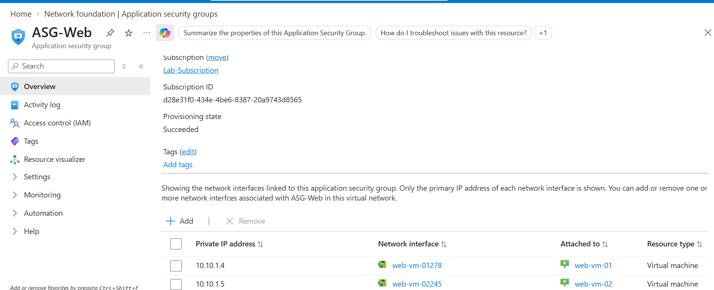

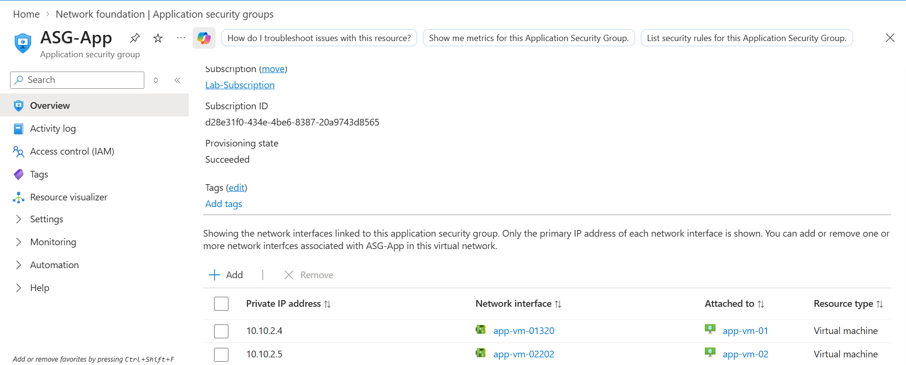

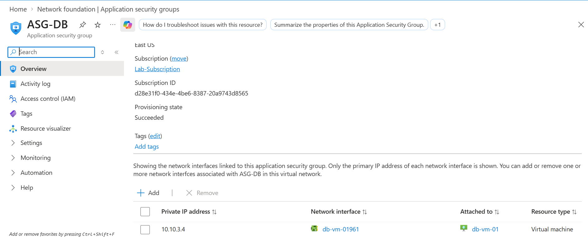

### Network Security Groups

NSGs were used to control inbound traffic between the application tiers.

The main security requirements were:

| Source | Destination | Port | Protocol | Action |
|---|---|---:|---|---|
| Internet | Web | 80 | TCP | Allow |
| Web | Application | 443 | TCP | Allow |
| Application | Database | 1433 | TCP | Allow |
| Web | Database | 1433 | TCP | Deny |

### Database NSG

The Database NSG allows TCP 1433 only when the source belongs to `ASG-App`.

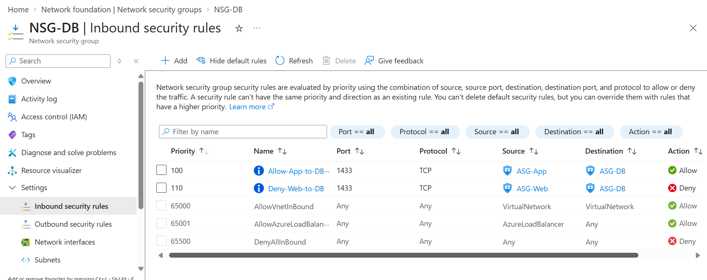

### Web NSG

The Web NSG was configured to permit the required inbound Web traffic.

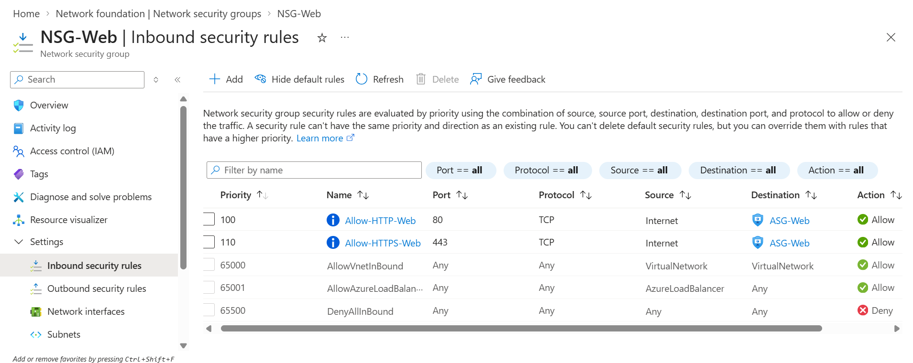

## Connectivity Testing

Network connectivity was tested from the VMs using `nc` (Netcat).

### Application → Database

The Application VM successfully connected to the Database VM on TCP 1433.

```text
azureuser@app-vm-01:~$ nc -vz 10.10.3.4 1433
Connection to 10.10.3.4 1433 port [tcp/ms-sql-s] succeeded!
```

Result: ALLOWED

This confirms that the NSG rule allowing ASG-App → ASG-DB on TCP 1433 was working as intended.

###Web → Database

The Web VM was tested against the Database VM on TCP 1433.
azureuser@web-vm-01:~$ nc -vz 10.10.3.4 1433
Connection timed out

Result: DENIED

This confirms that Web-tier traffic was not permitted to directly access the Database tier on TCP 1433.

## Azure Load Balancer

An Azure Load Balancer was deployed in front of the Web tier to distribute incoming TCP traffic across the Web VMs.

### Load Balancer Frontend

The Load Balancer provides a frontend IP address through which clients access the Web application.

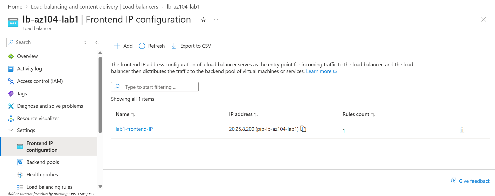

### Backend Pool

Both Web VMs were configured as backend targets of the Load Balancer.

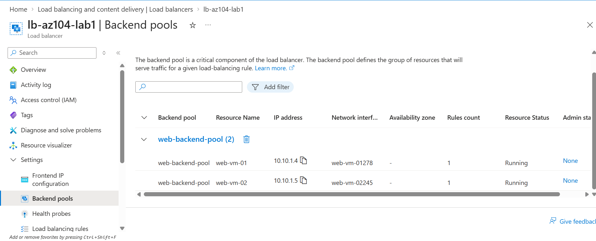

### Health Probe

A TCP health probe was configured to monitor the availability of the Web VMs.

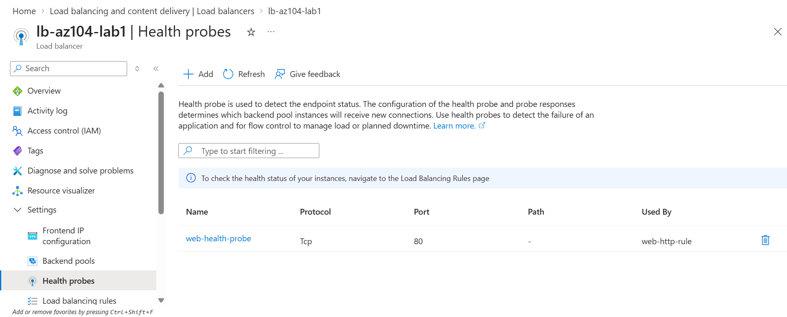

### Load-Balancing Rule

A load-balancing rule was configured to receive traffic on TCP port 80 and distribute it to the healthy backend Web VMs.

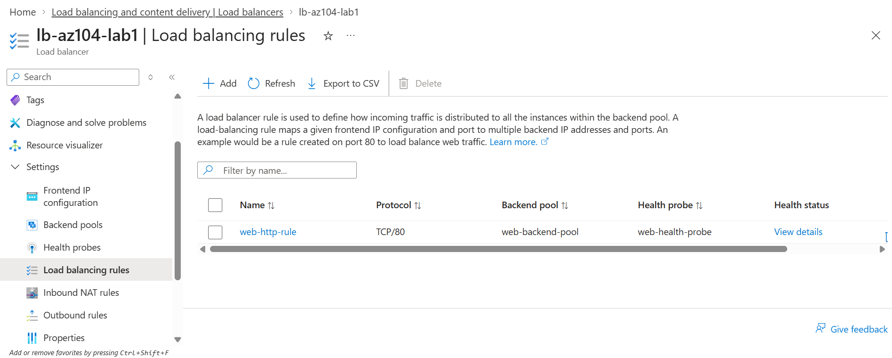

## Load Balancer Traffic Distribution

The Load Balancer was tested by accessing the frontend endpoint from a browser.

Traffic was successfully served by the Web tier through the Load Balancer.

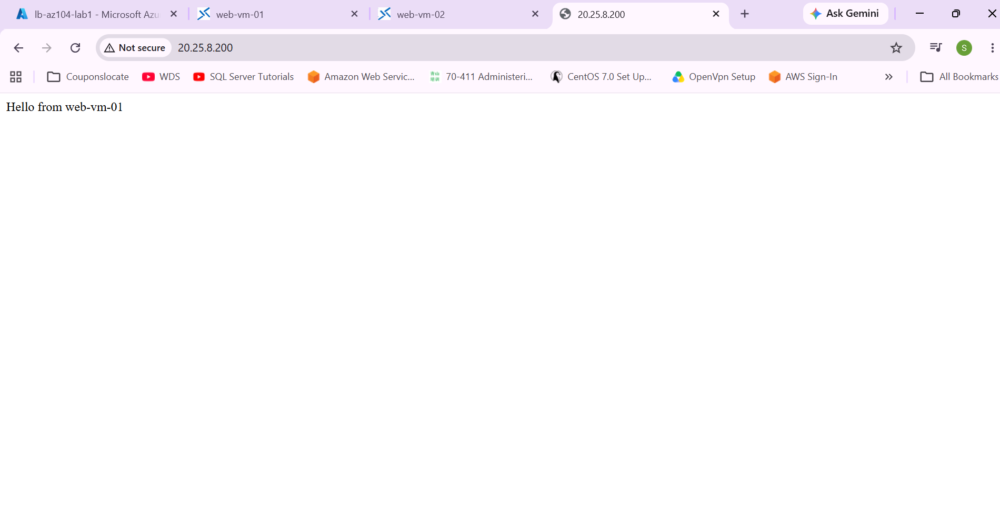

The test confirmed that the Load Balancer was able to forward client traffic to the backend Web VMs.

## Load Balancer Failover Test

To validate backend health monitoring and failover behavior, `web-vm-01` was stopped while `web-vm-02` remained running.

After the health probe detected that `web-vm-01` was unavailable, the Load Balancer continued serving traffic through the healthy backend VM.


### Result

```text
Before VM failure
        |
        v
Azure Load Balancer
        |
   +----+----+
   |         |
 VM01       VM02
 Healthy    Healthy


After VM01 was stopped
        |
        v
Azure Load Balancer
        |
        X
      VM01
        |
        v
      VM02
     Healthy
        |
        v
     Response
```

The test demonstrated that the Load Balancer removed the unhealthy backend from traffic distribution and continued serving requests through the healthy Web VM.


## Lessons Learned

This lab reinforced several important Azure networking concepts through hands-on implementation and troubleshooting:

- Network segmentation using Azure Virtual Networks and subnets
- Using ASGs to represent application tiers in NSG rules
- Controlling east-west traffic using NSGs
- Understanding the difference between allowed and denied connectivity
- Using Azure Bastion for private VM administration
- Configuring an Azure Load Balancer with frontend, backend pool, health probe, and load-balancing rule
- Understanding how health probes affect backend traffic distribution
- Validating network behavior using `nc` connectivity tests
- Troubleshooting connectivity based on connection timeout and connection refusal behavior
- Testing Load Balancer failover by intentionally stopping a backend VM


## AZ-104 Networking Concepts Demonstrated

This lab provided practical experience with the following Azure networking concepts:

- Azure Virtual Network (VNet)
- Subnetting and network segmentation
- Network Security Groups (NSGs)
- Application Security Groups (ASGs)
- Azure Bastion
- Azure Load Balancer
- Backend pools
- Health probes
- Load-balancing rules
- Private IP-based VM communication
- TCP connectivity testing
- Network security and traffic-flow validation
- Load Balancer health monitoring and failover

## Conclusion

This lab successfully implemented and validated a 3-tier application network in Azure.

The environment included Web, Application, and Database tiers with controlled communication using NSGs and ASGs. Azure Bastion provided private VM administration, while Azure Load Balancer provided traffic distribution and backend failover.

The implementation was validated through real connectivity tests and an intentional backend VM failure scenario.

**Status: Completed**