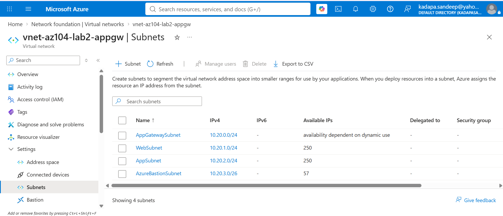

# Azure Networking Lab 2 — Azure Application Gateway with Path-Based Routing

## Overview

This lab demonstrates the implementation of an Azure Application Gateway
with path-based routing in a practical Azure network environment.

The objective was to deploy private Web and Application backend VMs,
provide secure management access using Azure Bastion, provide outbound
internet connectivity using Azure NAT Gateway, and expose the backend
applications through an Azure Application Gateway.

The Application Gateway was configured with:

- Public frontend IP
- HTTP listener
- Web backend pool
- Application backend pool
- Backend health monitoring
- Path-based routing
- Backend path override

The lab also included health-probe failure testing and troubleshooting
of backend path handling.

## Objectives

- Deploy a segmented Azure VNet
- Deploy private Web and Application VMs
- Configure Azure Bastion for management access
- Configure NAT Gateway for outbound internet connectivity
- Deploy Azure Application Gateway Standard V2
- Configure backend pools
- Configure HTTP listener
- Configure path-based routing
- Validate backend health
- Test backend failure detection
- Troubleshoot backend path routing

## Architecture

The lab uses Azure Application Gateway as the public entry point for
HTTP traffic.

The Application Gateway routes requests to different backend VMs
based on the URL path.

### Traffic Flow

```text
                         Internet
                            |
                            | HTTP :80
                            v
                 Azure Application Gateway
                       Public IP
                            |
                     HTTP Listener
                            |
                 +----------+----------+
                 |                     |
              /web/*                /app/*
                 |                     |
                 v                     v
             bp-web                  bp-app
                 |                     |
                 v                     v
            web-vm-01              app-vm-01
            10.20.1.4              10.20.2.4
                 |                     |
                 +----------+----------+
                            |
                       NAT Gateway
                            |
                         Internet
```

###Management Access
Administrator
     |
  Internet
     |
 Azure Bastion
     |
 Azure VNet
     |
 Private VMs

 ```markdown
## Network Configuration

### VNet

| Configuration | Value |
|---|---|
| VNet Name | `vnet-az104-lab2-appgw` |
| Address Space | `10.20.0.0/16` |

### Subnets

| Subnet | Address Range | Purpose |
|---|---|---|
| AppGatewaySubnet | `10.20.0.0/24` | Azure Application Gateway |
| WebSubnet | `10.20.1.0/24` | Web backend VM |
| AppSubnet | `10.20.2.0/24` | Application backend VM |
| AzureBastionSubnet | `10.20.3.0/26` | Azure Bastion |

### Backend VMs

| VM | Tier | Private IP |
|---|---|---|
| `web-vm-01` | Web | `10.20.1.4` |
| `app-vm-01` | Application | `10.20.2.4` |

### VNet and Subnets


