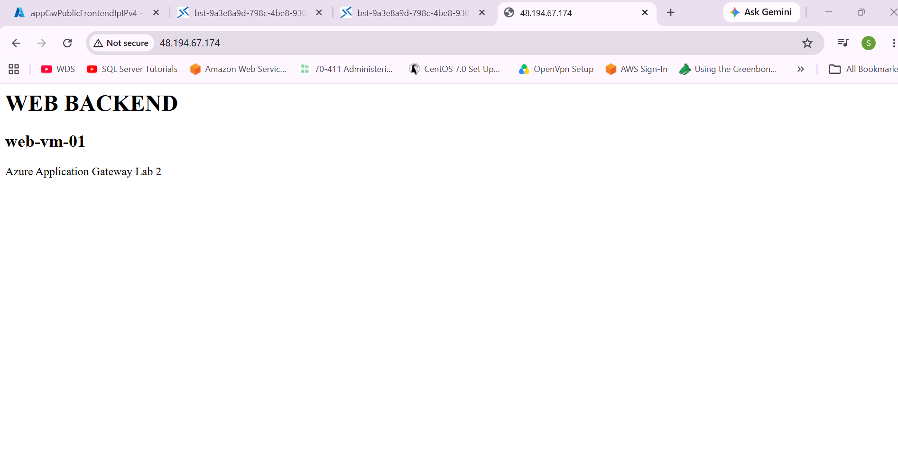
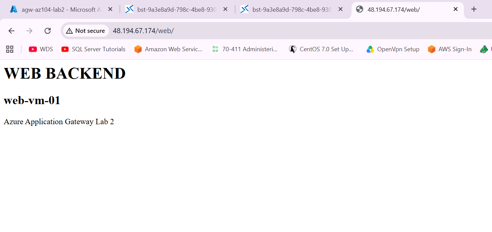
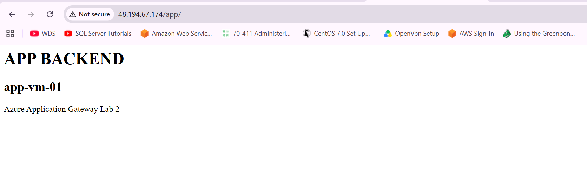
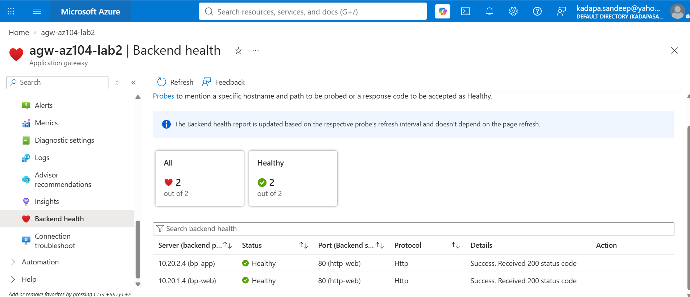
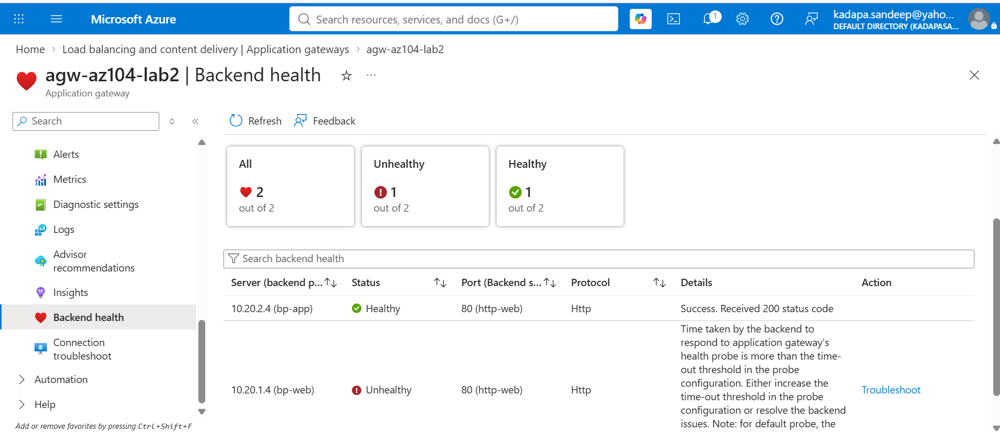
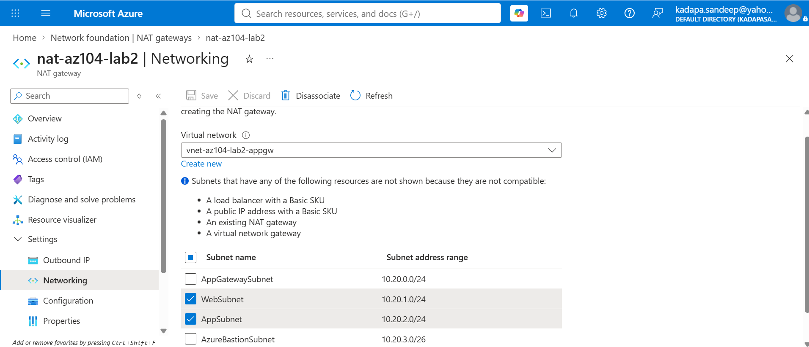
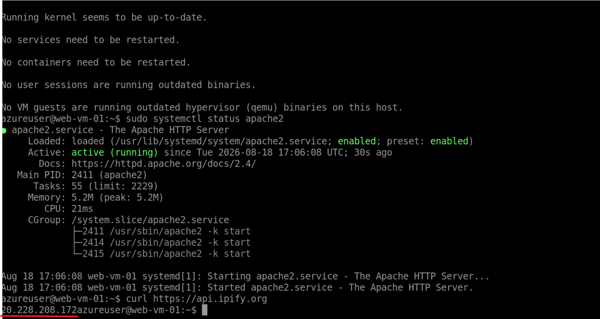
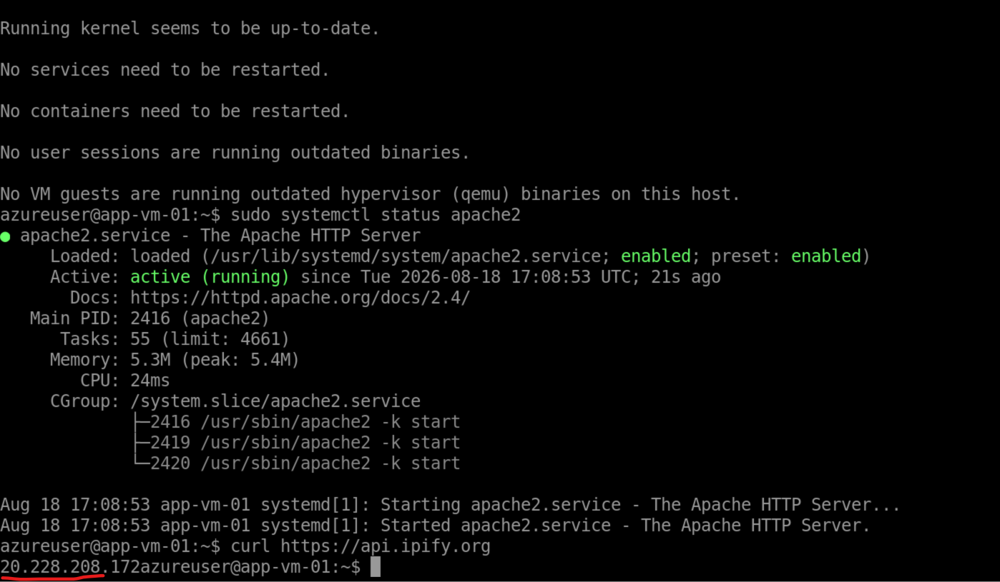

# Azure Networking Lab 2 — Application Gateway with Path-Based Routing

## Overview

This lab demonstrates a practical Azure Application Gateway architecture with private backend workloads and Layer 7 path-based routing.

The objective was to deploy Web and Application backend VMs, provide secure administrative access using Azure Bastion, provide outbound Internet connectivity using Azure NAT Gateway, and expose the backend applications through Azure Application Gateway.

The lab also included backend health monitoring, health-probe failure testing, path-based routing validation, and troubleshooting of backend URL path handling.

---

## Objectives

- Deploy a segmented Azure Virtual Network
- Deploy private Web and Application VMs
- Configure Azure Bastion for private VM management
- Configure NAT Gateway for outbound Internet connectivity
- Deploy Azure Application Gateway Standard V2
- Configure a public frontend IP
- Configure HTTP listener
- Configure backend pools
- Configure Layer 7 path-based routing
- Configure backend health monitoring
- Test backend failure detection
- Troubleshoot backend path handling
- Validate end-to-end application traffic

---

# Architecture

The lab uses Azure Application Gateway as the public Layer 7 entry point.

Backend VMs remain private and are accessed through Application Gateway for application traffic, Azure Bastion for administration, and NAT Gateway for outbound Internet connectivity.

## Architecture Diagram

```text
                              Internet
                                  |
                                  | HTTP :80
                                  v
                    +---------------------------+
                    |   Azure Application       |
                    |        Gateway            |
                    |      Standard V2          |
                    |       Public IP            |
                    +-------------+-------------+
                                  |
                     HTTP Listener / Path Routing
                                  |
                    +-------------+-------------+
                    |                           |
                 /web/*                      /app/*
                    |                           |
                    v                           v
              +-----------+               +-----------+
              |  bp-web   |               |  bp-app   |
              +-----+-----+               +-----+-----+
                    |                           |
                    v                           v
              web-vm-01                   app-vm-01
              10.20.1.4                   10.20.2.4
                    |                           |
                    +-------------+-------------+
                                  |
                           NAT Gateway
                                  |
                                  v
                              Internet


                    Administrator
                          |
                          v
                    Azure Bastion
                          |
                          v
                     Private VMs

```

## Traffic Model

| Traffic Type                | Azure Service       | Destination         |
| --------------------------- | ------------------- | ------------------- |
| Inbound application traffic | Application Gateway | Private backend VMs |
| Administrative access       | Azure Bastion       | Private backend VMs |
| Outbound Internet traffic   | NAT Gateway         | Internet            |


## Network Configuration
### Virtual Network:
| Configuration | Value                   |
| ------------- | ----------------------- |
| VNet Name     | `vnet-az104-lab2-appgw` |
| Address Space | `10.20.0.0/16`          |
| Region        | East US                 |

### Subnets
| Subnet             | Address Range  | Purpose                   |
| ------------------ | -------------- | ------------------------- |
| AppGatewaySubnet   | `10.20.0.0/24` | Azure Application Gateway |
| WebSubnet          | `10.20.1.0/24` | Web backend               |
| AppSubnet          | `10.20.2.0/24` | Application backend       |
| AzureBastionSubnet | `10.20.3.0/26` | Azure Bastion             |

### Backend Virtual Machines
| VM          | Tier        | Private IP  |
| ----------- | ----------- | ----------- |
| `web-vm-01` | Web         | `10.20.1.4` |
| `app-vm-01` | Application | `10.20.2.4` |

## Application Gateway Configuration

Azure Application Gateway was deployed as the public Layer 7 entry point for the application.

It provides:

Public frontend access
HTTP listener
Backend pool management
Layer 7 request routing
Health probing
Path-based routing

### Application Gateway
| Configuration      | Value                   |
| ------------------ | ----------------------- |
| Name               | `agw-az104-lab2`        |
| Tier               | Standard V2             |
| Region             | East US                 |
| Autoscaling        | Enabled                 |
| Minimum instances  | 0                       |
| Maximum instances  | 2                       |
| Availability Zones | 1, 2, 3                 |
| HTTP/2             | Enabled                 |
| VNet               | `vnet-az104-lab2-appgw` |
| Subnet             | `AppGatewaySubnet`      |
| Subnet Range       | `10.20.0.0/24`          |

### Frontend Configuration

A static Standard Public IP was configured as the Application Gateway frontend.

| Configuration  | Value                |
| -------------- | -------------------- |
| Frontend Type  | Public IPv4          |
| Public IP Name | `pip-agw-az104-lab2` |
| SKU            | Standard             |
| Assignment     | Static               |
| Availability   | Zone Redundant       |

### Backend Pools

Two backend pools were configured for the application.

| Backend Pool | Backend VM  | Private IP  |
| ------------ | ----------- | ----------- |
| `bp-web`     | `web-vm-01` | `10.20.1.4` |
| `bp-app`     | `app-vm-01` | `10.20.2.4` |

The backend VMs remain private and receive application traffic through Application Gateway.

### Backend HTTP Settings

HTTP backend settings were configured for communication between Application Gateway and the Apache web servers.
| Configuration    | Value      |
| ---------------- | ---------- |
| Backend Protocol | HTTP       |
| Backend Port     | 80         |
| Backend Setting  | `http-web` |

The backend VMs were running Apache HTTP Server on port 80.

### HTTP Listener

An HTTP listener was configured to receive incoming requests through the Application Gateway public frontend.
| Configuration | Value           |
| ------------- | --------------- |
| Listener      | `listener-http` |
| Protocol      | HTTP            |
| Port          | 80              |
| Frontend      | Public IP       |

### Path-Based Routing

Application Gateway was configured with path-based routing to direct incoming HTTP requests to different backend pools based on the URL path.

This demonstrates Layer 7 routing, where Application Gateway can inspect the HTTP request and make a routing decision based on the URL.

### Routing Configuration
| URL Path | Backend Pool | Backend VM  |
| -------- | ------------ | ----------- |
| `/web/*` | `bp-web`     | `web-vm-01` |
| `/app/*` | `bp-app`     | `app-vm-01` |


## Path-Based Routing Testing

The path-based routing configuration was tested through the Application Gateway public IP.

### Default Route

Accessing the Application Gateway public IP without a specific path routed the request to the Web backend.

http://<Application-Gateway-Public-IP>/


### Web Path

Accessing the /web/ path routed the request to the Web backend pool.

http://<Application-Gateway-Public-IP>/web/


### Application Path

Accessing the /app/ path routed the request to the Application backend pool.

http://<Application-Gateway-Public-IP>/app/


## Backend Health and Health Probes

Application Gateway uses health probes to determine whether backend targets are available to receive traffic.

### Backend Configuration
| Backend Pool | Backend VM  | Protocol | Port |
| ------------ | ----------- | -------- | ---- |
| `bp-web`     | `web-vm-01` | HTTP     | 80   |
| `bp-app`     | `app-vm-01` | HTTP     | 80   |

## Backend Health

Backend health was verified through the Application Gateway Backend Health section.


## Health Probe Failure Test

To validate Application Gateway health monitoring, web-vm-01 was intentionally stopped.

After the VM was stopped, the health probe detected that the backend was no longer responding and the backend was marked unhealthy.


The VM was subsequently started again and backend health was verified.

### Result

This test demonstrated that Application Gateway uses backend health status when determining whether a backend is available to receive application traffic.

## NAT Gateway and Outbound Connectivity

The backend VMs were deployed without public IP addresses.

Azure NAT Gateway was configured to provide outbound Internet connectivity for the private Web and Application VMs.

This allowed the VMs to access external services such as Ubuntu package repositories without assigning public IP addresses directly to the VMs.

### Nat Gateway Configuration
| Configuration      | Value                       |
| ------------------ | --------------------------- |
| NAT Gateway        | `nat-az104-lab2`            |
| Associated VNet    | `vnet-az104-lab2-appgw`     |
| Associated Subnets | Web and Application subnets |
| Public IP          | Static Standard Public IP   |



### Outbound Connectivity Test

Outbound connectivity was verified from both backend VMs using:

curl https://api.ipify.org

Both VMs returned the public IP associated with the NAT Gateway.





### Result

The test confirmed that private backend VMs could access the Internet through NAT Gateway while remaining without directly assigned public IP addresses.

## Azure Bastion and Private VM Management

Azure Bastion was used to provide secure administrative access to the private backend VMs.

The backend VMs did not require public IP addresses for SSH administration.

### Bastion Connectivity

A Bastion session was established to the private VM and the Apache service was verified.

### Result

The test confirmed that private VMs could be administered through Azure Bastion without exposing SSH directly to the Internet.

# Troubleshooting

## Issue: /app/ Returned HTTP 404

During testing of the path-based routing configuration, the /app/ request initially returned an Apache 404 Not Found response.

The Application Gateway routing itself was working because the request was reaching the Application backend VM.

### Root Cause

Application Gateway was correctly routing /app/ to app-vm-01.

However, the backend Apache server received the /app/ path.

The Apache web root contained: /var/www/html/index.html

but did not contain an /app/ directory.

Therefore, Apache returned:  404 Not Found

This confirmed that the issue was related to backend path handling rather than Application Gateway backend connectivity.

### Resolution

The Application Gateway backend setting was updated to use:

Override backend path: /

This caused Application Gateway to forward the request to the backend using the root path.

After configuring the backend path override, the /app/ request successfully returned:

APP BACKEND
app-vm-01
Azure Application Gateway Lab 2

## Security Design

The lab follows a private-backend architecture.

### Key Security Principles
Backend VMs do not require public IP addresses.
Application Gateway acts as the public application entry point.
Azure Bastion provides administrative access to private VMs.
NAT Gateway provides outbound Internet connectivity.
Application Gateway health probes monitor backend availability.
Backend workloads are separated into dedicated subnets.
Application traffic is routed through Application Gateway instead of exposing backend VMs directly.

## Key Learnings

This lab provided hands-on experience with Azure Application Gateway and supporting Azure networking services.

Application Gateway
Deployed Azure Application Gateway Standard V2.
Configured a public frontend IP.
Configured an HTTP listener.
Created separate Web and Application backend pools.
Implemented Layer 7 path-based routing.
Configured backend health monitoring.
Tested backend failure detection.
Path-Based Routing

Implemented:

/web/* → bp-web → web-vm-01
/app/* → bp-app → app-vm-01

This demonstrated how a single Application Gateway endpoint can route requests to different backend applications based on the URL path.

### NAT Gateway

Configured NAT Gateway to provide outbound Internet connectivity for private VMs.

Both backend VMs used the NAT Gateway public IP for outbound Internet access while remaining without directly assigned public IP addresses.

### Azure Bastion

Used Azure Bastion to securely connect to private VMs for administration without exposing SSH directly to the Internet.

### Troubleshooting

Encountered and resolved an Application Gateway backend path issue where /app/ initially returned 404 Not Found.

The issue was resolved using:

Override backend path: /

This demonstrated the importance of troubleshooting the complete request path rather than assuming that a healthy backend automatically means a successful application response.

### Technologies Used
Microsoft Azure
Azure Virtual Network
Azure Application Gateway Standard V2
Azure NAT Gateway
Azure Bastion
Azure Virtual Machines
Apache HTTP Server
Private IP addressing
HTTP / TCP
Layer 7 path-based routing
Application Gateway health probes

## Project Outcome

The lab successfully demonstrated a practical Azure Application Gateway architecture with private backend workloads.

The implementation validated:

Private Web and Application VMs
Azure Application Gateway Standard V2
Public HTTP frontend
HTTP listener
Separate backend pools
Layer 7 path-based routing
Backend health monitoring
Backend failure detection
NAT Gateway for outbound Internet connectivity
Azure Bastion for private VM administration
Backend path override
End-to-end application traffic testing

The final design separates inbound application traffic, administrative access, and outbound Internet connectivity using dedicated Azure services.

## Lab Cost

The lab was created as a temporary hands-on environment and deleted after testing to minimize Azure costs.

Approximate actual lab cost: ₹83

The use of Azure Spot VMs helped reduce compute costs during the lab.

Cost is specific to this lab run and should not be considered a fixed monthly cost for the architecture. ( I have used VMs which are on Spot discount)
